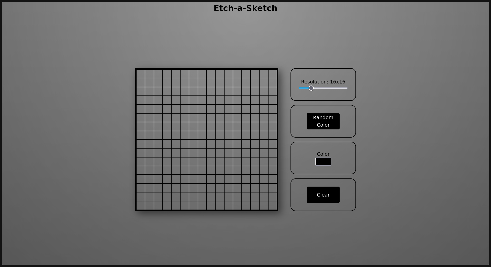

<h1 align='center'>🎨 ETCH-A-SKETCH</h1>

  <a href='#-sobre'>Sobre</a>
  &nbsp&nbsp|&nbsp&nbsp
  <a href='#-desenvolvimento'>Desenvolvimento</a>
  &nbsp&nbsp|&nbsp&nbsp
  <a href='#-funcionalidades'>Funcionalidades</a>
  &nbsp&nbsp|&nbsp&nbsp
  <a href='#-tecnologias'>Tecnologias</a>
  &nbsp&nbsp|&nbsp&nbsp
  <a href='#-licenca'>Licença</a>

    

    

## 💁‍♂️ Sobre o Projeto

Este projeto consiste em uma versão digital do clássico brinquedo Etch-a-Sketch, desenvolvido como parte do curso do Odin Project.

A aplicação permite que o usuário desenhe diretamente em uma grid interativa, alterando a resolução da grade e escolhendo diferentes modos de pintura.

O projeto foi desenvolvido com foco na prática de:
- manipulação do DOM;
- eventos do JavaScript;
- lógica de programação;
- criação dinâmica de elementos;
- utilização de Flexbox;
- interação entre HTML, CSS e JavaScript.

---

## 📅 Desenvolvimento

O projeto foi desenvolvido no primeiro semestre de 2026, durante meus estudos de JavaScript no Odin Project.

Esse projeto foi importante para aprofundar conceitos como:
- eventos do mouse;
- estados da aplicação;
- criação dinâmica de grids;
- manipulação de estilos via JavaScript.

---

## ✨ Funcionalidades

- 🎨 Modo de cor personalizada
- 🌈 Modo de cores aleatórias
- 🧹 Botão de limpar grid
- 📏 Alteração dinâmica da resolução
- 🖱️ Pintura ao clicar e arrastar
- 📱 Interface moderna e responsiva

---

## 🤖 Tecnologias

Esse projeto foi realizado com as seguintes tecnologias:

<ul>
    <li>HTML5</li>
    <li>CSS3</li>
    <li>JavaScript</li>
    <li>Flexbox</li>
    <li>Git e GitHub</li>
</ul>

---

## 🔑 Licença

Este projeto está sob a licença MIT.

___

Desenvolvido por Murilo Silva Papacidero 👤

